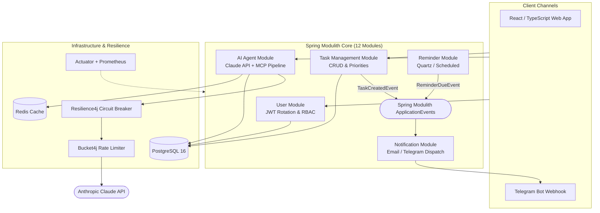

# 🤖 Klawa — Enterprise Modular AI Assistant Platform

[](https://openjdk.org/)
[](https://spring.io/projects/spring-boot)
[](https://spring.io/projects/spring-modulith)
[](https://www.postgresql.org/)
[](https://www.anthropic.com/)
[](https://testcontainers.com/)

An enterprise-grade modular monolith platform for task orchestration, contextual long-term memory reasoning, and multi-channel AI interaction.

---

## 🏛 System Architecture (Spring Modulith)



---

## ⚡ Key Architectural Highlights

### 1. Modular Monolith with Spring Modulith
- **12 Encapsulated Modules:** `User`, `Task`, `Reminder`, `Notification`, `Agent`, `Telegram`, `Analytics`, etc.
- **Strict Domain Layering:** Each module enforces `api`, `application`, `domain`, and `infrastructure` packages.
- **Architectural Verification:** Validated via `@ApplicationModuleTest` to prevent illegal cross-module dependencies.

### 2. Intelligent Contextual AI Pipeline
- **Anthropic Claude API & MCP:** Dynamic system prompts generated on-the-fly using stored user facts, active tasks, and historical dialogue context.
- **Asynchronous Fact Extraction:** An independent `@Async` background pipeline analyzes incoming conversations to persist long-term memory entries without degrading HTTP response latency.

### 3. Production Hardening & Fault Tolerance
- **Resilience4j Circuit Breaker:** Protects external AI calls with automatic degradation to cached/template fallbacks.
- **Bucket4j Token Bucket:** Enforces strict user rate limiting (e.g. 20 AI calls/hour) to avoid external quota burnout.
- **JWT Token Rotation:** Reusing an invalidated refresh token automatically triggers immediate session revocation across all devices.

### 4. 100% Realistic Integration Testing
- **Testcontainers Engine:** Zero reliance on in-memory H2 databases. Core persistence, relational schemas, and Redis caches are verified against live containerized environments in CI.

---

## 🚀 Quickstart with Docker Compose

```bash
# Clone the repository
git clone https://github.com/CHIKOJgg/klawa.git
cd klawa

# Launch infrastructure and application
docker compose up -d

# Check health metrics
curl http://localhost:8080/actuator/health
```
