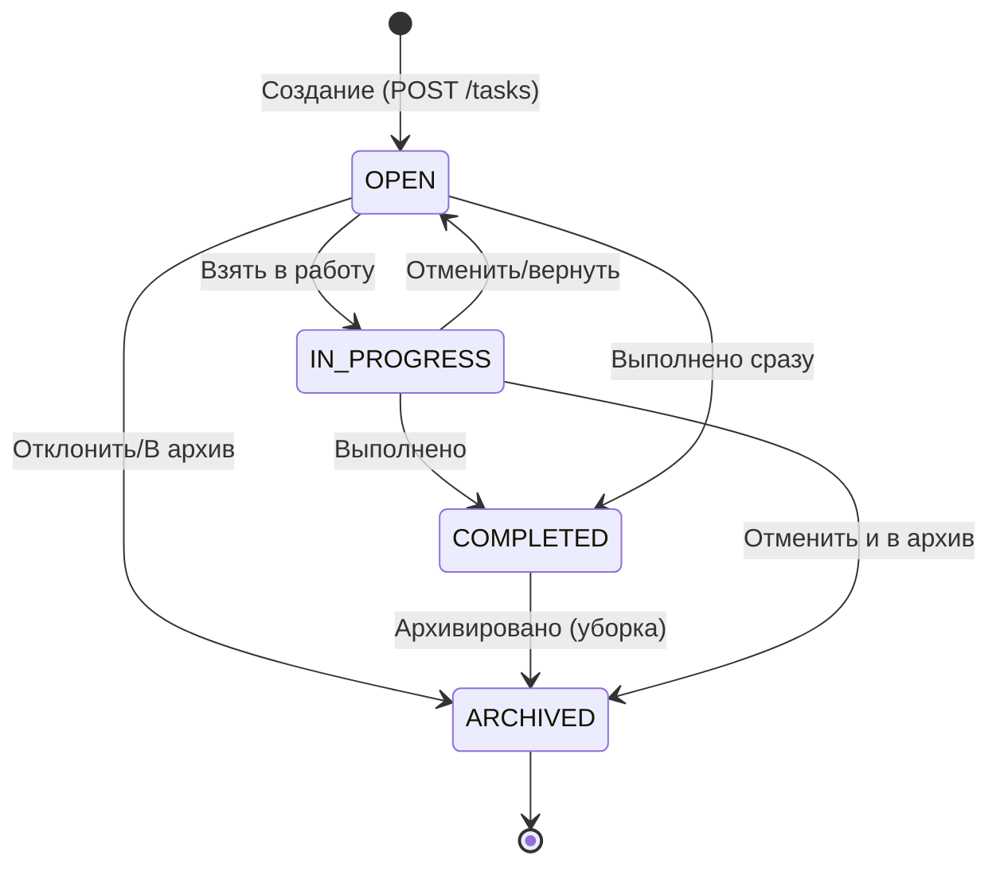
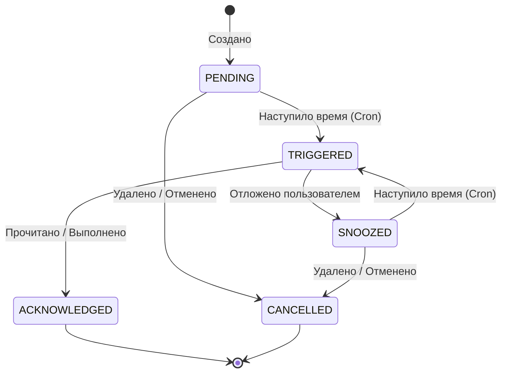

# Сценарии использования (Use Cases) - Klawa AI Assistant

## Сводная таблица вариантов использования

| ID | Название | Приоритет | Модуль | Статус |
|:---|:---|:---|:---|:---|
| UC-01 | Регистрация пользователя | HIGH | Auth | TO DO |
| UC-02 | Вход (аутентификация) | HIGH | Auth | TO DO |
| UC-03 | Обновление access-токена (refresh) | HIGH | Auth | TO DO |
| UC-04 | Выход (logout) | MEDIUM | Auth | TO DO |
| UC-05 | Получение профиля текущего пользователя | HIGH | Auth | TO DO |
| UC-06 | Создание проекта | HIGH | Project | TO DO |
| UC-07 | Просмотр списка проектов | HIGH | Project | TO DO |
| UC-08 | Обновление проекта | MEDIUM | Project | TO DO |
| UC-09 | Удаление проекта (soft delete) | MEDIUM | Project | TO DO |
| UC-10 | Создание задачи в проекте | HIGH | Task | TO DO |
| UC-11 | Просмотр списка задач (с фильтрами) | HIGH | Task | TO DO |
| UC-12 | Обновление задачи | HIGH | Task | TO DO |
| UC-13 | Переход статуса задачи | HIGH | Task | TO DO |
| UC-14 | Удаление задачи (soft delete) | MEDIUM | Task | TO DO |
| UC-15 | Создание напоминания для задачи | HIGH | Reminder | TO DO |
| UC-16 | Срабатывание напоминания (scheduler) | HIGH | Reminder | TO DO |
| UC-17 | Откладывание напоминания (snooze) | MEDIUM | Reminder | TO DO |
| UC-18 | Удаление напоминания | LOW | Reminder | TO DO |
| UC-19 | Получение списка уведомлений | HIGH | Notification | TO DO |
| UC-20 | Отметить уведомление прочитанным | MEDIUM | Notification | TO DO |
| UC-21 | Доставка уведомления через Telegram | HIGH | Notification | TO DO |
| UC-22 | Отправка сообщения в AI-чат | HIGH | Agent | TO DO |
| UC-23 | Просмотр истории переписки | HIGH | Agent | TO DO |
| UC-24 | AI создаёт задачу по запросу пользователя | HIGH | Agent, Task | TO DO |
| UC-25 | Генерация ежедневной/еженедельной сводки | MEDIUM | Agent | TO DO |
| UC-26 | Добавление факта в память вручную | MEDIUM | Memory | TO DO |
| UC-27 | Просмотр всех фактов | MEDIUM | Memory | TO DO |
| UC-28 | Поиск по памяти | MEDIUM | Memory | TO DO |
| UC-29 | Удаление факта | LOW | Memory | TO DO |
| UC-30 | AI автоматически извлекает факт из разговора | HIGH | Memory, Agent | TO DO |
| UC-31 | Привязка Telegram-аккаунта (deep-link) | HIGH | Telegram | TO DO |
| UC-32 | Отправка сообщения через Telegram-бота | HIGH | Telegram, Agent | TO DO |
| UC-33 | Получение сообщения через Telegram-бота | HIGH | Telegram, Agent | TO DO |
| UC-34 | Просмотр сводки по задачам | LOW | Analytics | TO DO |
| UC-35 | Просмотр динамики продуктивности | LOW | Analytics | TO DO |

## Конечные автоматы состояний

### Жизненный цикл задачи (Task)


### Жизненный цикл напоминания (Reminder)


---

## Детальное описание вариантов использования

### Модуль: Auth (Аутентификация и авторизация)

```markdown
### UC-01: Регистрация пользователя

**Актор**: Анонимный пользователь
**Предусловие**: Пользователь не авторизован в системе, email не занят
**Триггер**: Пользователь отправляет форму регистрации

**Основной сценарий**:
1. Пользователь вводит email, пароль и имя.
2. Система валидирует входные данные (формат email, сложность пароля).
3. Система проверяет, что пользователь с таким email не существует.
4. Система хэширует пароль.
5. Система создает запись пользователя в базе данных.
6. Система генерирует access и refresh токены.
7. Система возвращает токены и данные профиля пользователю.

**Альтернативные сценарии**:
- 2a. Данные невалидны: система возвращает ошибку 400 Bad Request с описанием.
- 3a. Email уже существует: система возвращает ошибку 409 Conflict.

**Постусловие**: Запись пользователя создана, сессия инициализирована (токены выданы).
**Затрагиваемые модули**: Auth, User
**API-эндпоинт**: POST /api/v1/auth/register
```

```markdown
### UC-02: Вход (аутентификация)

**Актор**: Пользователь (имеющий аккаунт)
**Предусловие**: Пользователь зарегистрирован в системе
**Триггер**: Пользователь отправляет форму входа с учетными данными

**Основной сценарий**:
1. Пользователь вводит email и пароль.
2. Система ищет пользователя по email в базе данных.
3. Система сравнивает хэш переданного пароля с хэшем в базе.
4. В случае совпадения, система генерирует новую пару токенов (access, refresh).
5. Система обновляет дату последнего входа.
6. Система возвращает токены аутентификации клиенту.

**Альтернативные сценарии**:
- 2a. Пользователь не найден: система возвращает ошибку 401 Unauthorized.
- 3a. Пароли не совпадают: система возвращает ошибку 401 Unauthorized (без уточнения причины).

**Постусловие**: Пользователь получает действительные токены для доступа к защищенным ресурсам.
**Затрагиваемые модули**: Auth, User
**API-эндпоинт**: POST /api/v1/auth/login
```

```markdown
### UC-03: Обновление access-токена (refresh)

**Актор**: Клиентское приложение (от имени пользователя)
**Предусловие**: У клиента есть валидный refresh-токен
**Триггер**: Access-токен истек или близок к истечению срока действия

**Основной сценарий**:
1. Клиент отправляет запрос с refresh-токеном.
2. Система проверяет подпись, валидность и срок действия refresh-токена.
3. Система проверяет, не отозван ли токен в базе (blacklist).
4. Система генерирует новый access-токен (опционально и новый refresh-токен).
5. Система возвращает новые токены клиенту.

**Альтернативные сценарии**:
- 2a. Токен недействителен или просрочен: система возвращает 401 Unauthorized, клиент перенаправляется на логин.
- 3a. Токен был отозван: система возвращает 401 Unauthorized.

**Постусловие**: Клиент получает свежий access-токен для продолжения работы.
**Затрагиваемые модули**: Auth
**API-эндпоинт**: POST /api/v1/auth/refresh
```

```markdown
### UC-04: Выход (logout)

**Актор**: Авторизованный пользователь
**Предусловие**: Пользователь имеет валидную сессию
**Триггер**: Пользователь нажимает кнопку "Выйти"

**Основной сценарий**:
1. Клиент отправляет запрос на выход с текущим refresh-токеном.
2. Система валидирует токен.
3. Система помечает данный refresh-токен как отозванный (помещает в blacklist).
4. Система возвращает успешный ответ клиенту.
5. Клиент удаляет токены из локального хранилища.

**Альтернативные сценарии**:
- 2a. Токен уже отозван или не передан: система все равно возвращает 200 OK для идемпотентности, но может залогировать подозрительную активность.

**Постусловие**: Токены аннулированы, сессия завершена.
**Затрагиваемые модули**: Auth
**API-эндпоинт**: POST /api/v1/auth/logout
```

```markdown
### UC-05: Получение профиля текущего пользователя

**Актор**: Авторизованный пользователь
**Предусловие**: Наличие валидного access-токена в заголовке Authorization
**Триггер**: Приложение загружается и запрашивает данные о пользователе

**Основной сценарий**:
1. Клиент отправляет GET-запрос с access-токеном.
2. Система извлекает ID пользователя из токена.
3. Система извлекает данные профиля из базы данных (имя, email, настройки).
4. Система возвращает JSON с профилем пользователя.

**Альтернативные сценарии**:
- 2a. Токен недействителен: система возвращает 401 Unauthorized.
- 3a. Пользователь был удален: система возвращает 404 Not Found.

**Постусловие**: Клиент отображает актуальную информацию о пользователе.
**Затрагиваемые модули**: Auth, User
**API-эндпоинт**: GET /api/v1/users/me
```

### Модуль: Projects (Проекты)

```markdown
### UC-06: Создание проекта

**Актор**: Авторизованный пользователь
**Предусловие**: -
**Триггер**: Пользователь инициирует создание нового проекта (папки для задач)

**Основной сценарий**:
1. Пользователь вводит название проекта, цвет и опциональное описание.
2. Клиент отправляет POST-запрос с данными проекта.
3. Система валидирует входные данные (название не пустое).
4. Система создает запись проекта в БД с привязкой к ID пользователя.
5. Система возвращает данные созданного проекта (включая сгенерированный ID).

**Альтернативные сценарии**:
- 3a. Название отсутствует или превышает лимит символов: система возвращает 400 Bad Request.

**Постусловие**: Новый проект доступен для добавления задач.
**Затрагиваемые модули**: Project
**API-эндпоинт**: POST /api/v1/projects
```

```markdown
### UC-07: Просмотр списка проектов

**Актор**: Авторизованный пользователь
**Предусловие**: -
**Триггер**: Открытие боковой панели навигации или раздела "Проекты"

**Основной сценарий**:
1. Клиент запрашивает список проектов.
2. Система извлекает из БД все активные (не удаленные) проекты пользователя.
3. Система подсчитывает количество активных задач для каждого проекта (опционально).
4. Система возвращает массив проектов.

**Альтернативные сценарии**:
- 2a. Проектов нет: система возвращает пустой массив `[]`.

**Постусловие**: Пользователь видит актуальный список своих проектов.
**Затрагиваемые модули**: Project
**API-эндпоинт**: GET /api/v1/projects
```

```markdown
### UC-08: Обновление проекта

**Актор**: Авторизованный пользователь
**Предусловие**: Проект существует и принадлежит пользователю
**Триггер**: Пользователь редактирует настройки проекта

**Основной сценарий**:
1. Пользователь изменяет название или цвет проекта.
2. Клиент отправляет PATCH-запрос с обновленными полями.
3. Система проверяет права доступа пользователя к проекту.
4. Система обновляет поля в БД.
5. Система возвращает обновленный объект проекта.

**Альтернативные сценарии**:
- 3a. Проект не существует или чужой: система возвращает 404 Not Found.
- 4a. Ошибка валидации данных: система возвращает 400 Bad Request.

**Постусловие**: Данные проекта обновлены.
**Затрагиваемые модули**: Project
**API-эндпоинт**: PATCH /api/v1/projects/{projectId}
```

```markdown
### UC-09: Удаление проекта (soft delete)

**Актор**: Авторизованный пользователь
**Предусловие**: Проект существует
**Триггер**: Пользователь подтверждает удаление проекта

**Основной сценарий**:
1. Клиент отправляет DELETE-запрос для проекта.
2. Система проверяет права пользователя.
3. Система устанавливает флаг `deleted_at` для проекта (soft delete).
4. Система каскадно устанавливает флаг soft delete для всех задач внутри проекта.
5. Система возвращает 204 No Content.

**Альтернативные сценарии**:
- 2a. Проект не найден: 404 Not Found.

**Постусловие**: Проект и его задачи скрыты от пользователя, но остаются в БД для возможного восстановления или аналитики.
**Затрагиваемые модули**: Project, Task
**API-эндпоинт**: DELETE /api/v1/projects/{projectId}
```

### Модуль: Tasks (Задачи)

```markdown
### UC-10: Создание задачи в проекте

**Актор**: Авторизованный пользователь / AI-агент
**Предусловие**: Указанный проект существует (опционально, может быть Inbox)
**Триггер**: Пользователь вводит текст задачи и нажимает Enter (или AI генерирует задачу)

**Основной сценарий**:
1. Клиент передает название задачи, описание, ID проекта, приоритет и dueDate (если есть).
2. Система валидирует данные.
3. Система проверяет наличие указанного проекта.
4. Система создает задачу со статусом OPEN.
5. Если передан dueDate, система может автоматически создать напоминание (через модуль Reminder).
6. Система возвращает созданную задачу.

**Альтернативные сценарии**:
- 3a. Проект не найден: возвращается 404.
- 1a. Отсутствует название: возвращается 400.

**Постусловие**: Задача создана и видна в списках.
**Затрагиваемые модули**: Task, Project, (Reminder)
**API-эндпоинт**: POST /api/v1/tasks
```

```markdown
### UC-11: Просмотр списка задач (с фильтрами)

**Актор**: Авторизованный пользователь
**Предусловие**: -
**Триггер**: Пользователь открывает список задач ("Сегодня", "Inbox", конкретный проект)

**Основной сценарий**:
1. Клиент отправляет запрос с query-параметрами фильтрации (например, `projectId`, `status`, `dueDate[lte]`).
2. Система валидирует параметры.
3. Система формирует SQL-запрос к БД с учетом фильтров пользователя.
4. Система извлекает данные и выполняет пагинацию.
5. Система возвращает список задач и метаданные пагинации.

**Альтернативные сценарии**:
- 2a. Неверный формат фильтров: возвращается 400 Bad Request.

**Постусловие**: Пользователь видит отфильтрованный список задач.
**Затрагиваемые модули**: Task
**API-эндпоинт**: GET /api/v1/tasks
```

```markdown
### UC-12: Обновление задачи

**Актор**: Авторизованный пользователь
**Предусловие**: Задача существует
**Триггер**: Пользователь изменяет текст, дату, приоритет или переносит в другой проект

**Основной сценарий**:
1. Клиент отправляет PATCH-запрос с измененными полями.
2. Система проверяет права на задачу.
3. Система валидирует новые данные (например, если меняется projectId, проверяется его существование).
4. Система сохраняет изменения в БД.
5. Система возвращает обновленный объект задачи.

**Альтернативные сценарии**:
- 3a. Целевой проект не найден: возвращается 400 Bad Request (или 404).

**Постусловие**: Свойства задачи обновлены.
**Затрагиваемые модули**: Task
**API-эндпоинт**: PATCH /api/v1/tasks/{taskId}
```

```markdown
### UC-13: Переход статуса задачи

**Актор**: Авторизованный пользователь / AI-агент
**Предусловие**: Задача существует и текущий статус допускает переход
**Триггер**: Пользователь кликает чекбокс выполнения или перетаскивает карточку (Kanban)

**Основной сценарий**:
1. Клиент отправляет запрос на смену статуса (например, на COMPLETED).
2. Система проверяет права доступа.
3. Система сверяется со state machine (допустим ли переход, например OPEN → COMPLETED).
4. Если переход валиден, система обновляет статус и фиксирует дату завершения (`completed_at`).
5. Если статус COMPLETED или ARCHIVED, система отменяет все активные напоминания по задаче.
6. Система возвращает обновленную задачу.

**Альтернативные сценарии**:
- 3a. Недопустимый переход: возвращается 409 Conflict.
- 5a. Сбой при отмене напоминаний: транзакция откатывается, возвращается 500.

**Постусловие**: Статус задачи изменен, связанные таймеры (reminders) деактивированы.
**Затрагиваемые модули**: Task, Reminder
**API-эндпоинт**: POST /api/v1/tasks/{taskId}/status
```

```markdown
### UC-14: Удаление задачи (soft delete)

**Актор**: Авторизованный пользователь
**Предусловие**: Задача существует
**Триггер**: Пользователь нажимает "Удалить"

**Основной сценарий**:
1. Клиент отправляет DELETE-запрос.
2. Система находит задачу и проверяет владельца.
3. Система устанавливает флаг `deleted_at`.
4. Система отменяет все активные напоминания по задаче.
5. Система возвращает 204 No Content.

**Альтернативные сценарии**:
- 2a. Задачи нет: 404 Not Found.

**Постусловие**: Задача удалена из активных списков, напоминания выключены.
**Затрагиваемые модули**: Task, Reminder
**API-эндпоинт**: DELETE /api/v1/tasks/{taskId}
```

### Модуль: Reminders (Напоминания)

```markdown
### UC-15: Создание напоминания для задачи

**Актор**: Авторизованный пользователь / AI / Система
**Предусловие**: Задача существует
**Триггер**: Пользователь задает время "Напомнить мне в..."

**Основной сценарий**:
1. Клиент передает taskId, время срабатывания (triggerAt) и тип (PUSH, TELEGRAM).
2. Система проверяет доступность задачи.
3. Система создает запись в таблице Reminders со статусом PENDING.
4. Система регистрирует job в фоновом планировщике (Scheduler/Queue).
5. Система возвращает объект напоминания.

**Альтернативные сценарии**:
- 1a. Время срабатывания в прошлом: 400 Bad Request.

**Постусловие**: Напоминание запланировано на исполнение.
**Затрагиваемые модули**: Reminder, Task
**API-эндпоинт**: POST /api/v1/tasks/{taskId}/reminders
```

```markdown
### UC-16: Срабатывание напоминания (scheduler)

**Актор**: Планировщик (Scheduler / Cron)
**Предусловие**: Наступило время `triggerAt`, статус PENDING или SNOOZED
**Триггер**: Внутренний таймер (например, Redis PubSub или cron-джоб)

**Основной сценарий**:
1. Планировщик извлекает напоминание из очереди.
2. Система проверяет, не завершена/удалена ли связанная задача.
3. Если задача активна, система формирует payload уведомления.
4. Система меняет статус напоминания на TRIGGERED.
5. Система передает payload в модуль Notification для доставки.
6. Система логирует успешное срабатывание.

**Альтернативные сценарии**:
- 2a. Задача уже выполнена (COMPLETED): напоминание меняет статус на CANCELLED, уведомление не отправляется.
- 5a. Ошибка доставки: производится N попыток (retry), при провале статус остается TRIGGERED, но фиксируется ошибка.

**Постусловие**: Уведомление сгенерировано и передано на доставку пользователю.
**Затрагиваемые модули**: Reminder, Notification, Task
**API-эндпоинт**: Внутренний вызов (не API)
```

```markdown
### UC-17: Откладывание напоминания (snooze)

**Актор**: Авторизованный пользователь
**Предусловие**: Напоминание сработало (TRIGGERED) или еще PENDING
**Триггер**: Пользователь нажимает "Отложить на 15 минут" в push-уведомлении

**Основной сценарий**:
1. Клиент отправляет POST-запрос с новым временем (или сдвигом, например +15m).
2. Система валидирует новое время.
3. Система обновляет статус на SNOOZED и задает новый `triggerAt`.
4. Система перерегистрирует задачу в планировщике.
5. Система возвращает обновленное напоминание.

**Альтернативные сценарии**:
- 3a. Напоминание уже было отменено (CANCELLED): 400 Bad Request.

**Постусловие**: Напоминание отложено и сработает позже.
**Затрагиваемые модули**: Reminder
**API-эндпоинт**: POST /api/v1/reminders/{reminderId}/snooze
```

```markdown
### UC-18: Удаление напоминания

**Актор**: Авторизованный пользователь
**Предусловие**: Напоминание существует
**Триггер**: Пользователь удаляет напоминание через UI

**Основной сценарий**:
1. Клиент отправляет DELETE-запрос.
2. Система проверяет права.
3. Система меняет статус на CANCELLED (или удаляет запись).
4. Система убирает job из планировщика (если возможно).
5. Возвращает 204.

**Альтернативные сценарии**:
- 2a. Не найдено: 404.

**Постусловие**: Напоминание больше не сработает.
**Затрагиваемые модули**: Reminder
**API-эндпоинт**: DELETE /api/v1/reminders/{reminderId}
```

### Модуль: Notifications (Уведомления)

```markdown
### UC-19: Получение списка уведомлений

**Актор**: Авторизованный пользователь
**Предусловие**: -
**Триггер**: Пользователь открывает шторку уведомлений (Inbox)

**Основной сценарий**:
1. Клиент запрашивает последние уведомления с пагинацией.
2. Система извлекает уведомления пользователя, сортируя по дате убывания.
3. Система подсчитывает количество непрочитанных.
4. Система возвращает список и метаданные.

**Альтернативные сценарии**:
- 2a. Уведомлений нет: возвращается пустой список.

**Постусловие**: Пользователь видит историю уведомлений.
**Затрагиваемые модули**: Notification
**API-эндпоинт**: GET /api/v1/notifications
```

```markdown
### UC-20: Отметить уведомление прочитанным

**Актор**: Авторизованный пользователь
**Предусловие**: Уведомление существует и имеет статус "не прочитано"
**Триггер**: Пользователь кликает на уведомление

**Основной сценарий**:
1. Клиент отправляет запрос на отметку как прочитанного.
2. Система обновляет флаг `is_read = true` (или `read_at = now()`).
3. Если это было связано с Reminder, может обновиться статус Reminder -> ACKNOWLEDGED.
4. Система возвращает 200 OK.

**Альтернативные сценарии**:
- 2a. Уведомление уже прочитано: идемпотентно возвращается 200 OK.

**Постусловие**: Счетчик непрочитанных уменьшается.
**Затрагиваемые модули**: Notification, (Reminder)
**API-эндпоинт**: POST /api/v1/notifications/{notificationId}/read
```

```markdown
### UC-21: Доставка уведомления через Telegram

**Актор**: Система
**Предусловие**: Сгенерировано уведомление для пользователя, у которого привязан TG
**Триггер**: Модуль Notification определяет канал доставки как TELEGRAM

**Основной сценарий**:
1. Система извлекает `telegram_chat_id` пользователя из базы.
2. Система форматирует сообщение (текст задачи, кнопки действий Markdown/Inline).
3. Система вызывает внутренний сервис Telegram модуля.
4. Модуль Telegram отправляет запрос к API Telegram (sendMessage).
5. При успешном ответе от TG, система отмечает уведомление как "отправленное".

**Альтернативные сценарии**:
- 1a. Telegram не привязан: фоллбэк на PUSH или Email, либо отказ.
- 4a. Бот заблокирован пользователем: API TG возвращает 403. Система удаляет `telegram_chat_id` или помечает как неактивный.

**Постусловие**: Пользователь получает сообщение в Telegram.
**Затрагиваемые модули**: Notification, Telegram
**API-эндпоинт**: Внутренний вызов (не API)
```

### Модуль: Agent (AI chat)

```markdown
### UC-22: Отправка сообщения в AI-чат

**Актор**: Авторизованный пользователь
**Предусловие**: -
**Триггер**: Пользователь пишет текстовое сообщение (или аудио) в интерфейсе чата

**Основной сценарий**:
1. Клиент отправляет сообщение пользователя на сервер.
2. Система сохраняет сообщение в БД (история диалога).
3. Система формирует контекст (последние сообщения, профиль юзера, текущее время).
4. Система отправляет запрос к LLM.
5. LLM генерирует ответ.
6. Система сохраняет ответ LLM в БД.
7. Система возвращает ответ клиенту (через SSE/WebSocket для стриминга или обычным REST).

**Альтернативные сценарии**:
- 4a. Тайм-аут API провайдера LLM: система возвращает сообщение об ошибке генерации.
- 4b. LLM решает вызвать инструмент (Tool Call), см. UC-24.

**Постусловие**: Диалог продолжен, пользователь получил текстовый ответ.
**Затрагиваемые модули**: Agent
**API-эндпоинт**: POST /api/v1/agent/messages
```

```markdown
### UC-23: Просмотр истории переписки

**Актор**: Авторизованный пользователь
**Предусловие**: -
**Триггер**: Открытие вкладки "AI Ассистент"

**Основной сценарий**:
1. Клиент запрашивает список сообщений сессии.
2. Система извлекает сообщения (роли: user, assistant, system/tool) с пагинацией.
3. Система отфильтровывает технические сообщения (tool_calls, если они скрыты от пользователя).
4. Возвращает список.

**Альтернативные сценарии**:
- 2a. История пуста: возвращается пустой массив.

**Постусловие**: Пользователь видит контекст разговора.
**Затрагиваемые модули**: Agent
**API-эндпоинт**: GET /api/v1/agent/messages
```

```markdown
### UC-24: AI создаёт задачу по запросу пользователя (tool use)

**Актор**: AI-агент (LLM)
**Предусловие**: Пользователь написал "Напомни мне купить молоко завтра"
**Триггер**: Во время генерации ответа LLM (UC-22) решает вызвать tool `create_task`

**Основной сценарий**:
1. LLM возвращает специальный payload с вызовом функции `create_task(title="Купить молоко", dueDate="завтра")`.
2. Система-оркестратор перехватывает tool call.
3. Система вызывает внутренний метод модуля Task (аналогично UC-10).
4. Задача создается в БД.
5. Система отправляет результат выполнения (ID созданной задачи) обратно в LLM.
6. LLM генерирует финальный ответ пользователю: "Я добавил задачу 'Купить молоко' на завтра."
7. Ответ отправляется клиенту, UI может отобразить виджет созданной задачи.

**Альтернативные сценарии**:
- 3a. Невалидные аргументы от LLM: система возвращает ошибку в LLM, заставляя перегенерировать запрос.

**Постусловие**: Создана новая задача, пользователь уведомлен.
**Затрагиваемые модули**: Agent, Task
**API-эндпоинт**: POST /api/v1/agent/messages (часть флоу)
```

```markdown
### UC-25: Генерация ежедневной/еженедельной сводки

**Актор**: Планировщик (Scheduler) -> AI-агент
**Предусловие**: У пользователя включена настройка "Утренний бриф"
**Триггер**: Наступление заданного времени (например, 08:00)

**Основной сценарий**:
1. Планировщик запускает процесс сборки брифа.
2. Система извлекает просроченные задачи, задачи на сегодня и ближайшие.
3. Система собирает факты из Memory за последнее время.
4. Система формирует промпт для LLM: "Сделай мотивирующую сводку на день по этим данным...".
5. LLM генерирует текст брифа.
6. Система сохраняет текст и отправляет его как Notification (Push или Telegram).

**Альтернативные сценарии**:
- 2a. Задач на сегодня нет: LLM генерирует сообщение "На сегодня задач нет, отличный день для отдыха!".

**Постусловие**: Пользователь получает персонализированную сводку.
**Затрагиваемые модули**: Agent, Task, Notification
**API-эндпоинт**: Внутренний cron-job
```

### Модуль: Memory (Память / Контекст)

```markdown
### UC-26: Добавление факта в память вручную

**Актор**: Авторизованный пользователь
**Предусловие**: -
**Триггер**: Пользователь хочет, чтобы ассистент запомнил что-то важное ("У меня аллергия на орехи")

**Основной сценарий**:
1. Пользователь вводит текст в раздел "Память".
2. Клиент отправляет POST-запрос.
3. Система генерирует векторный эмбеддинг для текста (через модель эмбеддингов).
4. Система сохраняет текст и вектор в БД (например, pgvector).
5. Возвращает созданную запись.

**Альтернативные сценарии**:
- 3a. Ошибка сервиса эмбеддингов: возвращается 503 Service Unavailable.

**Постусловие**: Факт доступен для поиска при генерации ответов AI.
**Затрагиваемые модули**: Memory
**API-эндпоинт**: POST /api/v1/memory
```

```markdown
### UC-27: Просмотр всех фактов

**Актор**: Авторизованный пользователь
**Предусловие**: -
**Триггер**: Пользователь открывает раздел управления памятью

**Основной сценарий**:
1. Клиент запрашивает список сохраненных фактов.
2. Система извлекает записи из БД (возможно, сгруппированные).
3. Возвращает список (текст, дата добавления, источник - "вручную" или "AI").

**Альтернативные сценарии**:
- 2a. Память пуста: возвращается пустой список.

**Постусловие**: Пользователь видит, что о нем знает AI.
**Затрагиваемые модули**: Memory
**API-эндпоинт**: GET /api/v1/memory
```

```markdown
### UC-28: Поиск по памяти

**Актор**: AI-агент (внутренний процесс)
**Предусловие**: Идет обработка запроса пользователя (UC-22)
**Триггер**: Оркестратор решает обогатить контекст перед запросом к LLM (RAG)

**Основной сценарий**:
1. Система берет последнее сообщение пользователя.
2. Система генерирует векторный эмбеддинг сообщения.
3. Система выполняет поиск по косинусному сходству (Vector Search) в БД памяти.
4. Извлекаются топ-N релевантных фактов.
5. Найденные факты добавляются в системный промпт LLM ("Контекст о пользователе: ...").

**Альтернативные сценарии**:
- 4a. Релевантных фактов не найдено (similarity < threshold): контекст остается пустым.

**Постусловие**: LLM отвечает с учетом персонализированных знаний.
**Затрагиваемые модули**: Memory, Agent
**API-эндпоинт**: Внутренний вызов (часть флоу UC-22)
```

```markdown
### UC-29: Удаление факта

**Актор**: Авторизованный пользователь
**Предусловие**: Факт существует
**Триггер**: Пользователь нажимает крестик на факте ("Забудь это")

**Основной сценарий**:
1. Клиент отправляет DELETE-запрос.
2. Система проверяет права.
3. Система физически удаляет запись и ее вектор из БД (hard delete).
4. Возвращает 204.

**Альтернативные сценарии**:
- 2a. Факт не найден: 404.

**Постусловие**: Информация больше не учитывается AI.
**Затрагиваемые модули**: Memory
**API-эндпоинт**: DELETE /api/v1/memory/{factId}
```

```markdown
### UC-30: AI автоматически извлекает факт из разговора

**Актор**: Фоновый процесс AI (Background Worker)
**Предусловие**: Завершен диалог с пользователем или получено новое сообщение
**Триггер**: Пользователь написал "У моей жены день рождения 15 мая"

**Основной сценарий**:
1. После ответа пользователю, сообщение асинхронно отправляется в легковесную LLM на анализ.
2. Промпт: "Есть ли здесь долгосрочные факты о пользователе, которые стоит запомнить?"
3. LLM определяет факт: "Жена пользователя родилась 15 мая".
4. Система вызывает функцию добавления факта в память (UC-26 внутренне).
5. Факт сохраняется с пометкой `source: AI_EXTRACTED`.

**Альтернативные сценарии**:
- 3a. LLM не находит важных фактов: процесс завершается.
- 3b. Факт конфликтует с существующим: LLM-обозреватель может инициировать перезапись (опционально, сложно).

**Постусловие**: База знаний обогатилась без явного участия пользователя.
**Затрагиваемые модули**: Memory, Agent
**API-эндпоинт**: Внутренний фоновый процесс
```

### Модуль: Telegram (Интеграция с мессенджером)

```markdown
### UC-31: Привязка Telegram-аккаунта (deep-link)

**Актор**: Авторизованный пользователь
**Предусловие**: -
**Триггер**: Пользователь в настройках нажимает "Привязать Telegram"

**Основной сценарий**:
1. Система генерирует уникальный одноразовый токен (OTP) и сохраняет его.
2. Система отдает клиенту ссылку вида `https://t.me/KlawaBot?start={token}`.
3. Пользователь переходит по ссылке и нажимает Start.
4. Telegram отправляет Webhook на сервер Klawa с `/start {token}` и `chat_id`.
5. Система ищет пользователя по токену, сохраняет `chat_id` в профиль.
6. Бот отвечает в TG: "Аккаунт успешно привязан!".

**Альтернативные сценарии**:
- 5a. Токен просрочен или неверен: бот отвечает ошибкой "Ссылка недействительна".

**Постусловие**: Пользователь может управлять задачами через Telegram.
**Затрагиваемые модули**: Telegram, User
**API-эндпоинт**: POST /api/v1/telegram/webhook (от TG)
```

```markdown
### UC-32: Отправка сообщения через Telegram-бота

**Актор**: Система
**Предусловие**: Аккаунт привязан
**Триггер**: Необходимо отправить проактивное сообщение или ответ AI

**Основной сценарий**:
1. Система формирует текст сообщения (HTML или MarkdownV2).
2. Система вызывает API Telegram (POST https://api.telegram.org/bot<token>/sendMessage).
3. Telegram доставляет сообщение пользователю.
4. Система логирует успешную отправку.

**Альтернативные сценарии**:
- 2a. Ошибка сети при вызове API: система ставит в очередь на повторную отправку (retry).

**Постусловие**: Пользователь видит сообщение в мессенджере.
**Затрагиваемые модули**: Telegram
**API-эндпоинт**: Вызов внешнего API TG
```

```markdown
### UC-33: Получение сообщения через Telegram-бота (webhook)

**Актор**: Пользователь (через Telegram)
**Предусловие**: Бот привязан
**Триггер**: Пользователь пишет боту "Добавь задачу: купить хлеб"

**Основной сценарий**:
1. Telegram отправляет POST запрос на Webhook сервера с объектом `Update`.
2. Система извлекает `chat_id` и текст сообщения.
3. Система находит пользователя в БД по `chat_id`.
4. Система перенаправляет текст в модуль Agent (эмуляция UC-22).
5. LLM обрабатывает запрос, вызывает Tool (UC-24) и генерирует ответ.
6. Ответ отправляется обратно в Telegram (UC-32).

**Альтернативные сценарии**:
- 3a. Пользователь не найден: бот отвечает "Пожалуйста, авторизуйтесь через веб-приложение".

**Постусловие**: Запрос обработан так же, как если бы был задан в веб-интерфейсе.
**Затрагиваемые модули**: Telegram, Agent, Task
**API-эндпоинт**: POST /api/v1/telegram/webhook
```

### Модуль: Analytics (Аналитика и статистика)

```markdown
### UC-34: Просмотр сводки по задачам

**Актор**: Авторизованный пользователь
**Предусловие**: -
**Триггер**: Пользователь открывает дашборд

**Основной сценарий**:
1. Клиент запрашивает статистику (за текущую неделю).
2. Система делает агрегационные SQL-запросы: сколько создано, сколько завершено, сколько просрочено.
3. Возвращает JSON со счетчиками.

**Альтернативные сценарии**:
- 2a. Ошибка БД: возвращается 500.

**Постусловие**: Клиент отрисовывает круговые диаграммы/метрики.
**Затрагиваемые модули**: Analytics, Task
**API-эндпоинт**: GET /api/v1/analytics/summary
```

```markdown
### UC-35: Просмотр динамики продуктивности

**Актор**: Авторизованный пользователь
**Предусловие**: -
**Триггер**: Открытие графика продуктивности

**Основной сценарий**:
1. Клиент отправляет запрос с интервалом (например, последние 30 дней).
2. Система группирует выполненные задачи по дням (`DATE(completed_at)`).
3. Возвращает массив вида `[{date: "2023-10-01", count: 5}, ...]`.
4. Клиент строит bar chart или line chart.

**Альтернативные сценарии**:
- 1a. Слишком большой диапазон: система ограничивает максимум 365 днями или возвращает 400.

**Постусловие**: Пользователь анализирует свои тренды продуктивности.
**Затрагиваемые модули**: Analytics, Task
**API-эндпоинт**: GET /api/v1/analytics/trends
```
